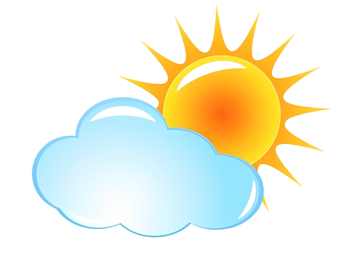

# WeatherWill - Weather Application



WeatherWill is a responsive weather application that provides current weather conditions, astronomical data, and air quality information for locations worldwide.

## Features

- **Current Weather Data**: Temperature, feels-like, humidity, wind speed/direction
- **Detailed Forecast**: Visibility, cloud cover, precipitation, UV index
- **Astronomical Information**: Sunrise/sunset, moonrise/moonset, moon phase
- **Air Quality Metrics**: CO, NO₂, O₃, SO₂, PM2.5, PM10 levels
- **Responsive Design**: Works on all device sizes
- **Location Search**: Find weather by city name

## Technologies Used

- **Frontend**: HTML5, CSS3, JavaScript
- **API**: [Weatherstack API](https://weatherstack.com/)
- **Icons**: Font Awesome, Google Material Icons
- **Hosting**: GitHub Pages

## API Information

WeatherWill uses the Weatherstack API to fetch weather data. The API provides:

- Real-time weather data
- Astronomical information
- Air quality metrics (where available)
- Location details

API Key is currently embedded in the code (for demo purposes only). In production, this should be secured via environment variables.

## File Structure

```
WeatherWill/
├── index.html          # Main application file
├── images/             # Weather condition icons
│   ├── clear.png
│   ├── cloud.png
│   ├── mist.png
│   ├── partly-cloudy.png
│   ├── rain.png
│   ├── snow.png
│   ├── thunderstorm.png
│   └── windy.png
├── bg.jpg              # Background image
└── sun-cloud.png       # Application favicon
```

## Setup Instructions

1. Clone the repository:
   ```bash
   git clone https://github.com/aakash-test7/WeatherWill.git
   ```

2. Open `index.html` in your browser

3. Alternatively, access the live version on GitHub Pages

## Usage

1. Enter a city name in the search box
2. Click the search button or press Enter
3. View comprehensive weather information

## Customization

To customize WeatherWill:

1. **API Key**: Replace with your own Weatherstack API key
2. **Styling**: Modify the CSS in the `<style>` section
3. **Icons**: Replace images in the `images/` folder
4. **Background**: Change `bg.jpg` to your preferred background

## Limitations

- Requires internet connection to fetch API data
- Free Weatherstack API has limited requests
- Air quality data not available for all locations

## Future Enhancements

- 5-day forecast
- Weather maps
- Temperature unit toggle (C/F)
- Geolocation for automatic location detection

## License

This project is open source and available under the MIT License.

---

**Note**: This application is for educational/demonstration purposes only. The API key shown is a demo key and may have usage limits. For production use, obtain your own API key from [weatherstack.com](https://weatherstack.com/).
